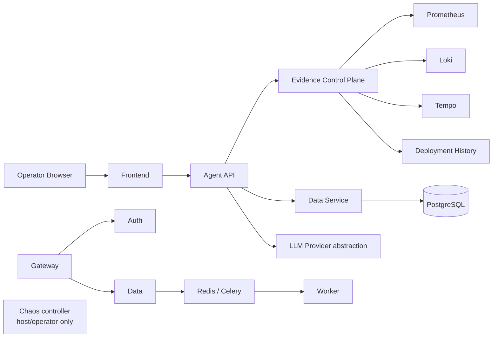

# IncidentPilot

Evidence-driven autonomous incident investigation for SRE workflows with bounded tools, historical incident memory, tamper-evident audit, chaos evaluation, and explicit human approval controls.

IncidentPilot does not execute production-changing remediation.

## Overview

IncidentPilot provides a monitored multi-service sandbox and an operator console for investigating persisted incidents. The Agent API collects and presents bounded, read-only operational evidence, correlates it with historical incident memory, persists a structured diagnosis and proposal, and stops at a human decision gate.

## Key Features

- FastAPI services backed by PostgreSQL, Redis, and Celery
- Prometheus metrics, OpenTelemetry traces, Loki logs, Tempo traces, and Grafana dashboards
- Read-only evidence adapters for current service status, metrics, logs, traces, and deployment history
- Persisted investigation steps, diagnoses, proposals, historical memory, and tamper-evident audit records
- Operator console with bearer-token sessions and backend-authoritative roles
- Proposal approval/rejection records with proposal hash and version binding
- Deterministic chaos and evaluation harnesses for the sandbox

## Architecture



The Agent API has no Docker socket, shell, direct PostgreSQL, Redis, Celery, chaos-control, or arbitrary HTTP capability. Evidence collection and any future execution capability are separate by design.

## Application Sandbox

The sandbox models a gateway, authentication service, data service, Redis/Celery queue, and worker. It is intentionally a local, monitored environment for operational investigation and evaluation.

## Evidence Plane

The Agent API reaches the evidence control plane through typed, allow-listed calls. Evidence is classified as current operational evidence or historical memory. Historical memory is always an analogy, never current proof.

## Investigation Workflow

1. An authenticated operator views a persisted incident.
2. The Agent API records structured investigation steps using bounded evidence tools.
3. A diagnosis cites current evidence and records uncertainty.
4. A remediation proposal is persisted with a hash and version.
5. An approver can record approval or rejection. This does not execute remediation.

## Historical Incident Memory

Historical memories are retrieved through typed queries and displayed in the console with the label **Historical analogy — not current proof**. They remain untrusted context; current evidence is mandatory for a diagnosis.

## Security Model

Bearer tokens are validated server-side into an `OperatorIdentity`. The console stores only the active token in `sessionStorage` and obtains the role from `GET /v1/me`; it does not guess permissions client-side. The backend remains authoritative for RBAC and all proposal decisions.

The control plane has no generic shell execution, Docker access, raw telemetry query console, infrastructure mutation API, or direct datastore credentials.

## Human Approval Model

Proposal decisions bind an incident, proposal ID, proposal hash, proposal version, and request ID. The console shows these values in a confirmation dialog before an approve or reject request. It states:

> APPROVAL DOES NOT EXECUTE REMEDIATION

> This records a human decision only. IncidentPilot does not execute remediation.

## Chaos Evaluation

Chaos scenarios are restricted to host/operator-only control. Deterministic evaluation records compare investigation output with benchmark ground truth without exposing hidden truth to the Agent API or operator console.

## Operator Console

The React/Vite console provides incident browsing, filters, pagination, a detailed investigation workspace, current evidence, historical memory, diagnosis uncertainty, proposals, and role-gated decision controls. It includes no execute, restart, deploy, rollback, scale, Docker, shell, SQL, or chaos controls.

## Running Locally

Copy `.env.example` to `.env`, fill required local secrets, then start the sandbox:

```sh
docker compose config --quiet
docker compose build
docker compose up -d --wait
docker compose ps --all
```

The operator console is available at `http://127.0.0.1:3001`; the Agent API is available at `http://127.0.0.1:8002`.

## Testing

```sh
python -m pytest
python -m ruff check .
python -m ruff format --check .
python -m mypy
python -m pip check

cd frontend
npm test
npm run lint
npm run typecheck
npm run build
```

## Current Validation

The repository includes unit, security-boundary, contract, persistence, and frontend component tests. Compose validation verifies service health and migration completion. The current Alembic head is `0007_benchmark_persistence`.

## Current Limitations

- REAL AGENT EVALUATION BLOCKED — NO CONFIGURED LLM PROVIDER
- MANUAL BASELINE PENDING — NO RECORDED HUMAN RUNS
- No real-model diagnostic-accuracy claim is made.
- IncidentPilot does not execute production-changing remediation.